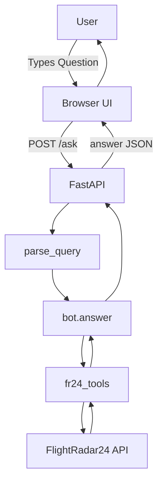

```mermaid

flowchart TD
  User -->|Types Question| UI[Browser UI]
  UI -->|POST /ask| API[FastAPI]
  API --> NLU[parse_query]
  NLU --> BOT[bot.answer]
  BOT --> TOOLS[fr24_tools]
  TOOLS --> FR24[FlightRadar24 API]
  FR24 --> TOOLS
  TOOLS --> BOT
  BOT --> API
  API -->|answer JSON| UI
  UI --> User

```
